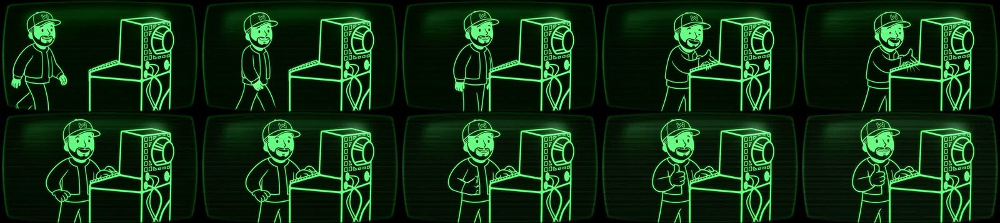

I wanted a place to write that felt like mine - not another Medium page or a LinkedIn article that disappears in the feed after a day. I also didn't have weeks to spend on it. So this site is mostly the result of describing what I wanted to coding agents, reviewing what came back, and saying "no, not like that" a few times.

Here's roughly how it came together.

---

## Day one: a terminal with a few moods

The first version went up on September 8th, in a single day. The brief was basically "an engineering notebook that feels like an old terminal." Out of that came:

- Three color themes - phosphor green, amber, and paper - that you can flip between from the header.
- A five-second boot sequence on the homepage with typed diagnostics. You can skip it with Enter or Escape, and it remembers if you'd rather never see it again 😅.
- Vim motions, because of course. `j` / `k` to move, `gg` and `G` for top and bottom, `h` / `l` for back and forward, `/` to search, `?` for the cheat sheet, and `:reboot` if you want the boot sequence again.
- A bit of "code dust" that trails the cursor, and a GitHub panel that pulls in my public activity, releases, and contribution graph at deploy time.

## The walk-on: fal.ai and about fifty cents

The artwork on the homepage is a little Vault Boy-style version of me at a terminal. I wanted it to move - walk up, type a few keys, give a thumbs-up.

That ended up being one request to Kling 2.1 Pro through fal.ai. The setup was a generated opening keyframe (me mid-stride, hands off the keyboard), the existing artwork as the ending frame, and a written motion prompt. A piece of it:

> The bearded man in the W baseball cap takes two short, natural steps to the right toward the stationary retro terminal... He stops at the keyboard, taps a few keys, then turns his head toward the viewer, smiles, and raises his free hand in a clear thumbs-up.

One paid render, about $0.49 at the advertised rate, and it was good enough on the first try. There's a little facial drift mid-walk if you go frame by frame - I can live with it. The amber and paper versions weren't separate renders either - they were recolored locally with FFmpeg from the approved green clip.

The part I didn't expect: the agent wrote the brief like a spec. Inputs, render targets, a negative prompt, and a checklist for reviewing the result (watch the hands, check the cap lettering, make sure he actually walks instead of sliding). That's the same thing I'd want from a person doing the work.

## Markdown, with guardrails

A week later the posts moved out of a hardcoded JavaScript file and into plain Markdown, rendered by a small renderer package I maintain. The build is strict on purpose - it refuses a post that repeats its title as a heading, links to remote images, or references a file outside its own folder. Drafts never make it into the published site.

That strictness is what makes "a few prompts" workable. There are over a hundred tests now, and an agent can't quietly break the site without one of them complaining.

## The contact card

Cursor's background agents built the digital contact card - a vCard download, a themed QR code page for conferences, and a CRT-filtered headshot - across a handful of small pull requests, each with screenshots attached for review.

## This week, with Claude Code

Getting ready for the ICC debrief, Claude Code:

- Took about 40 phone photos down to 11, resized them, and stripped the GPS data before anything got committed.
- Added the "Book a call" button to the header and fixed the divider styling.
- Rewrote `j` / `k` on article pages to actually scroll - and then chased down why holding the key acted like a toggle. Best guess: one of my many browser extensions was eating the key-up event 🤓.
- Moved the whole site onto my own Cloudflare account and this domain, with a redirect so every old link still lands on the right page.

## What I'd tell someone trying this

Describe the outcome, not the steps. Put the boring guardrails in early - tests, a strict build, a check before anything deploys - because they're what let you trust the next prompt. And review everything. The agents did the typing. I still had to decide what "good" looked like.

Cheers 🥃
