I'm a bit late getting this out... I always manage to pay for time away... 

But now that I'm back and settled from ICC 2026.... here's a little brain dump of my takeaways. 

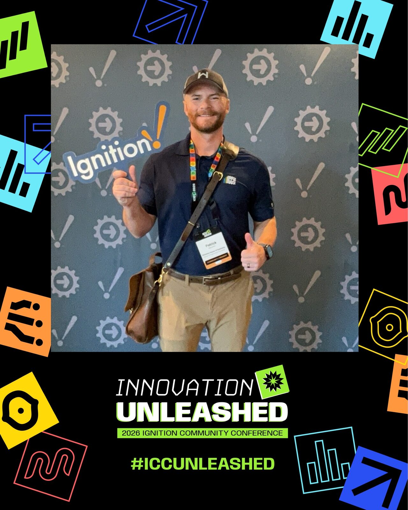

---

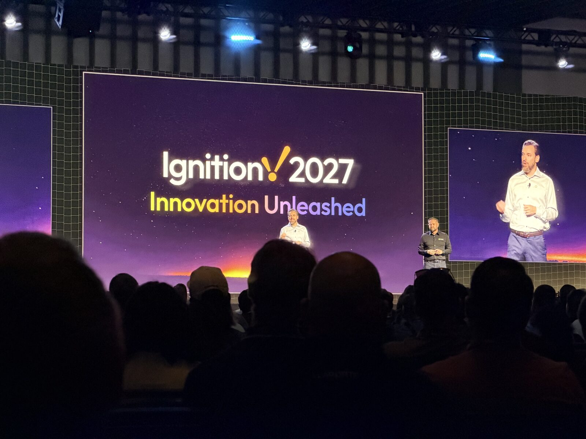

Ignition Catalyst was the headline for a lot of people, and the split between Core and Agent matters more than the branding does. In some ways I was surprised and in others a little underwhelmed. 

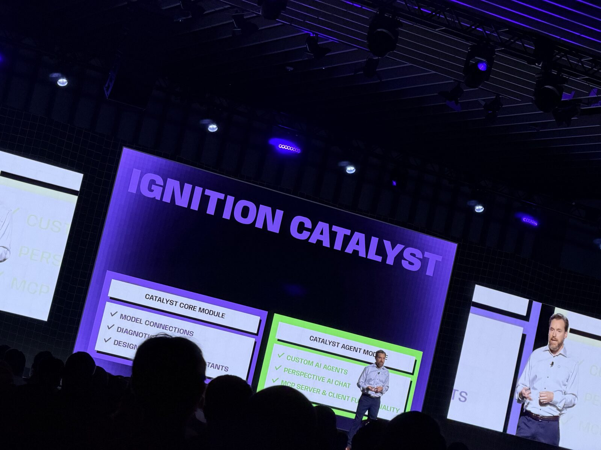

Catalyst Core lives in the Designer. Chatbot-style invocation in the places you already work, plus diagnostic LLM chat when something's broken. It's free with Ignition Core, bring-your-own-key, and it does not invoke from outside the Designer or the gateway webpage. That last bit is intentional, I think - scoped to the tools you use to build, not a free-floating agent hanging off production. I've seen a lot of commentary about having to pay for using their first party MCP server from external clients being a hindrance - but reality is this will likely be the normal 2 hour trial I anticipate. If that holds, I don't think this matters much for development. I'm also navigating agentic Ignition development just fine as is with my own tools anyway 🤓 - [Ignition MCP](https://github.com/WhiskeyHouse/ignition-mcp), the [Ignition CLI](https://github.com/TheThoughtagen/ignition-cli), and the [Agentic Ignition Stack](https://github.com/TheThoughtagen/agentic-ignition-stack).

Catalyst Agent is the other half: build agents with skills / plugins / tools (including custom tools) against your gateway. There's a Perspective component for runtime interfacing so you can change gateway / project behavior through those agents. MCP client and server for bidirectional access to and from Ignition. You can define your own agents and tools. Price TBD. I was positively surprised by the runtime agentic "chat" window, and do think this will be very nice and low maintenance for a lot of teams. 

Inductive also committed to an annual major release cadence starting next year with Ignition 2027. That changes how you plan upgrades and how you talk about "what's coming" with ops and leadership. Yearly majors mean less "wait for the big one" and more "what are we taking in this cycle."

---

Kevin Collins (Principal Software Engineer at Inductive Automation) gave a talk on the Ignition Ansible Collection that was one of the more practical sessions for anyone still living in non-container installs (😵‍💫). First-party supported infrastructure-as-code for those environments - they already ship Helm charts and Docker Compose for the container path, this is the other side. Targets Ignition 8.3 and up because of the API surface.

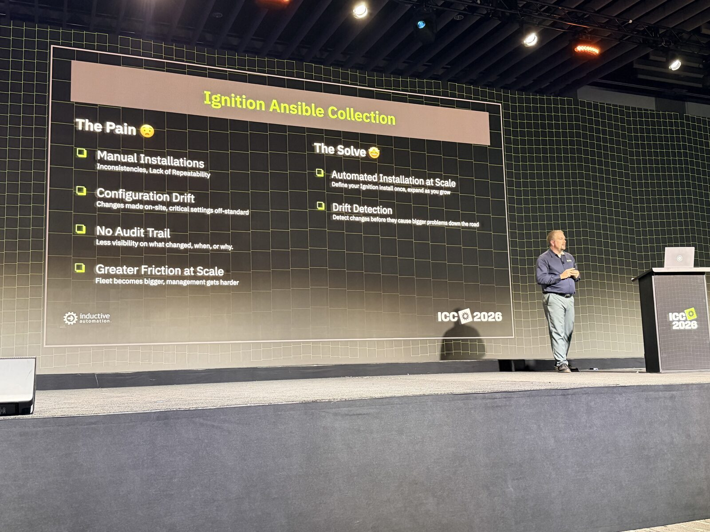

The pain he named is familiar: manual installs, config drift, no real audit trail, and scale friction when you're standing up more than a couple gateways. The Collection's job is to automate the install path and put drift detection in the loop so you're not rediscovering snowflake gateways six months later.

The scale-out situation he walked was concrete, and practical - prep, then Postgres, then GAN CA, then backend pairs, then frontends. Behavior modes mattered as much as the task order: `any_errors_fatal`, `serial`, and `block` / `rescue` / `always` so a bad node doesn't silently leave you half-deployed. Road ahead he sketched was CLI → Navigator → AWX → AAP. I've got a note to myself to follow up with Kevin on the playbooks. At our scale I've avoided Kubernetes, since it would mean procuring a third on-prem server or introducing a cloud dependency.

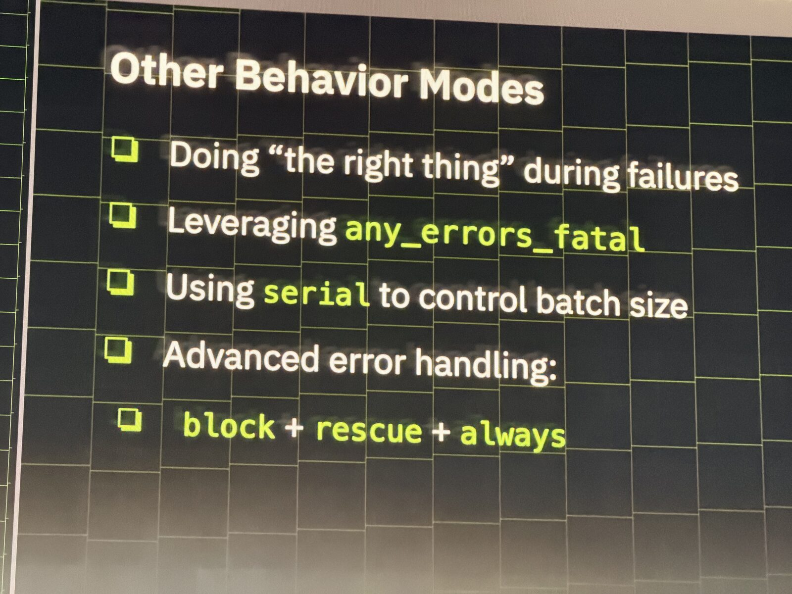

---

On the CI/CD side, both Inductive Automation and BW Design Group (Keith Gamble heads up BW DG's Ignition work) showed how they're deploying the demo sites (IA) and hyper-scaling Ignition in the data-center realm (BWDG), and it lined up with a lot of what I've been pushing internally and in my own open-source work.

Ignition 8.3 migration themes showed up repeatedly: filesystem resources, VCS as the source of truth, and clearer deployment modes so the gateway's internal state stops being the dependency everyone accidentally builds around. Pair that with DB migrations and you start treating Ignition projects like normal software and less like a pet server. Using unit, integration, and e2e tests - as well as a proper branching strategy and pull-requests - are becoming musts for industrial software now too.

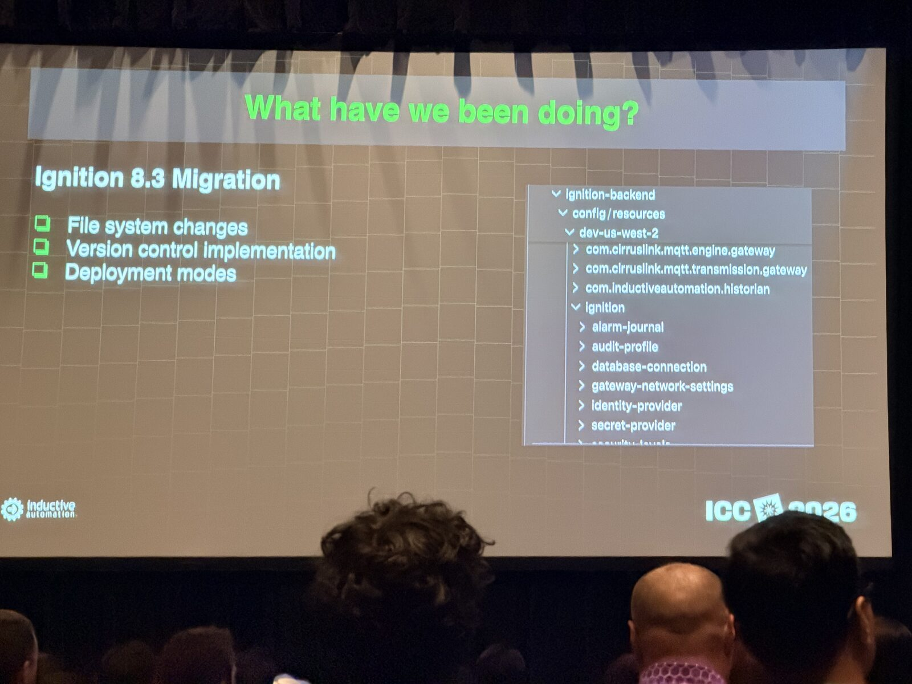

That's the workflow the [Ignition CLI](https://github.com/TheThoughtagen/ignition-cli) is built for, and why I built [Ignition Dev Tools](https://github.com/TheThoughtagen/ignition-ide-plugins) - editing Perspective-embedded scripts in Neovim (plus VS Code and Zed) with Ignition API completions and lint feedback, then writing them back into the resource.

Kubernetes path they described: ECS → EKS, Helm via charts.ia.io, cert-manager, redundancy, Ingress. On EKS specifically - external-secrets, s3-csi, git-sync, KEDA. They also showed Argo for CI/CD, Git (obviously), and "Stoker" - a Kubernetes-based git-sync path to trigger continuous deployments. Unit and integration tests on pull requests. Custom linting for code standards and Perspective best practices.

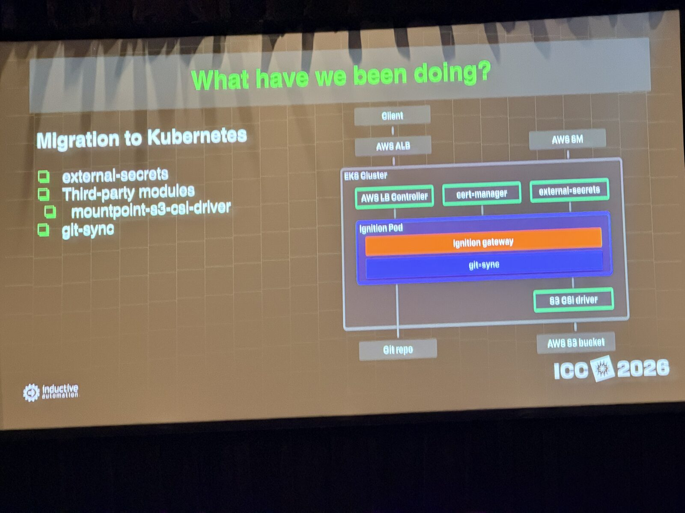

There's a factory-OS ↔ industrial-software mapping frame in there that I keep coming back to. The enterprise-grade needs aren't mysterious: reliability / security / governance / ops. Software practices applied to industrial SCADA without pretending the plant floor is a SaaS app.

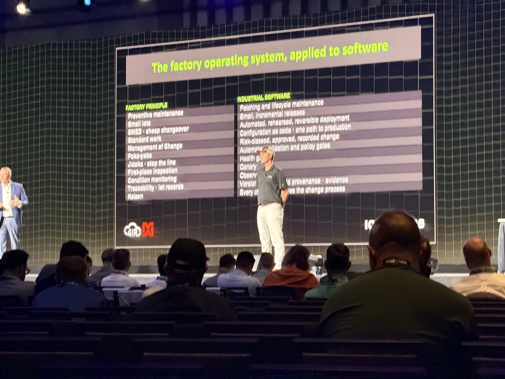

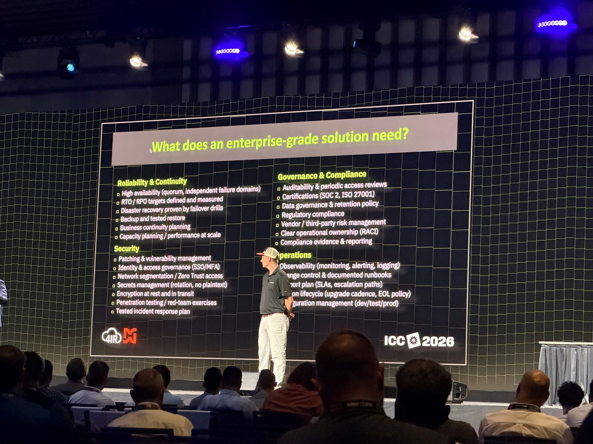

The system integrator model is shifting. I think there's a realization setting in on that across the industry this year - quieter than Catalyst, but you could feel it in how people talked about delivery and staffing - and what "building" even means when agents and CI are in the loop.

BW Design Group built their Build-a-Thon entry fully agentically. That's how I've been building in Ignition for the past six months or so. Watching a team do it in public, on a clock, made the pattern feel less like a personal workflow quirk and more like where the work is going. I'm sure it opened a few eyes. 

---

AI doing things with data, from about every vendor in the hall, got fatiguing. Same pitch shape, different logo. Useful demos exist - I'm not dismissing the category - but after the third "here's our model on your historian" booth, I stopped taking notes.

Knowledge graphs were the exception that still had my attention.

I've been alpha-testing Flow Software's Timebase Atlas for the past few months. Obviously this helps AI systems reason over plant data, but I also think the relationship orientation of graph structures hits industrial data hard on its own - assets / lots / equipment / events, and the edges between them, matter as much as the time series. Strongly typed, modular, composable, with real connectivity into the rest of the Timebase stack. I'll write a deeper piece on Atlas later.

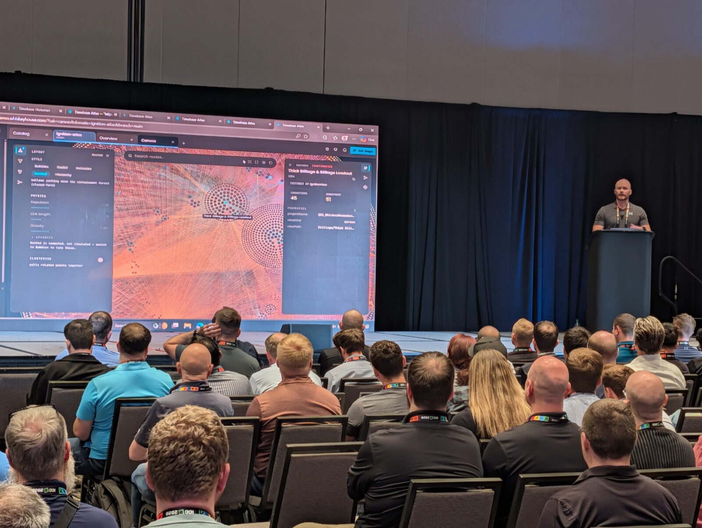

I also got to be part of Flow's ICC 2026 talk. I helped the team shape it, then took about six minutes on stage myself for the end-user story - how we're actually using Atlas and what I think of the product today. The piece I most wanted people to hear: encoding user personas into the model, so the analytics people need are unlocked for them instead of buried behind whoever knows where the data lives. Big thanks to Jeff / Graeme / Lenny and the rest of the Flow team for having me up there.

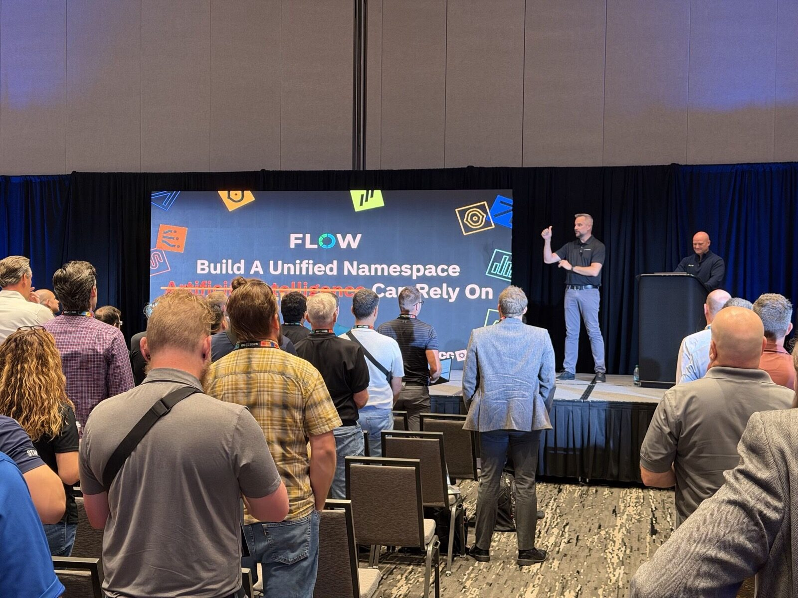

---

## Tools I mentioned

All open source, all built for Ignition 8.3+:

- [Ignition CLI](https://github.com/TheThoughtagen/ignition-cli) (`ign`) - one binary to operate and inspect a gateway (health, projects, tags, test rigs) without opening the gateway webpage or Designer. Scriptable JSON output for humans and agents alike. [Docs](https://thethoughtagen.github.io/ignition-cli/)
- [Ignition MCP](https://github.com/WhiskeyHouse/ignition-mcp) - a local MCP server in front of `ign`, adding workflow tools, resources, and runbook prompts so agents can work against a gateway. [Docs](https://whiskeyhouse.github.io/ignition-mcp/)
- [Agentic Ignition Stack](https://github.com/TheThoughtagen/agentic-ignition-stack) - a development-only starter for Git-native Ignition work: Docker Compose, `ign`, Ignition MCP, a Claude Code plugin, gateway Jython tests, and Playwright Perspective tests, with a [Git-managed example project](https://github.com/TheThoughtagen/agentic-ignition-example-project).
- [Ignition Dev Tools](https://github.com/TheThoughtagen/ignition-ide-plugins) - Neovim (LazyVim), VS Code, and Zed tooling for editing Ignition scripts with API completions and linting. [Docs](https://thethoughtagen.github.io/ignition-ide-plugins/)

Cheers 🥃
